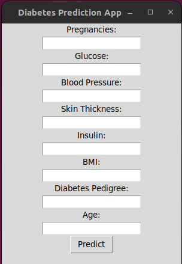

# Diabetes Predictor with Machine Learning

The Diabetes Predictor with Machine Learning is an open-source project that utilizes machine learning techniques to predict the likelihood of an individual developing diabetes based on their health and lifestyle data. By analyzing a set of input features, the system generates accurate predictions to help individuals assess their risk of diabetes.

## Features

- **Diabetes Prediction**: The system predicts the probability of an individual having diabetes based on their input data.
- **User-Friendly Interface**: The project includes a user-friendly interface where users can input their health and lifestyle data for prediction.
- **Easy Integration**: The project is designed to be easily integrated into existing healthcare systems or used as a standalone application.

## Installation

To run the Diabetes Predictor project locally, follow these steps:

1. Clone the repository: `git clone https://github.com/your-username/diabetes-predictor.git`
2. Navigate to the project directory: `cd diabetes-predictor`
4. Run the application: `main.py`
5. Window will pop up

## Usage

1. Enter the required health and lifestyle data into the provided input fields.
2. Click the "Predict" button to generate a prediction.
3. View the prediction result

## Contributing

Contributions to the Diabetes Predictor with Machine Learning project are welcome and encouraged. If you have any ideas, suggestions, or bug reports, please open an issue or submit a pull request. We value and appreciate your feedback.

## Acknowledgements

We would like to express our gratitude to the developers and contributors of the open-source libraries and datasets used in this project. Their valuable work has greatly contributed to the success of this project.

**Disclaimer: The Diabetes Predictor with Machine Learning project is for educational and informational purposes only. It should not be used as a substitute for professional medical advice or diagnosis. Always consult a healthcare professional for any medical concerns or decisions.**
